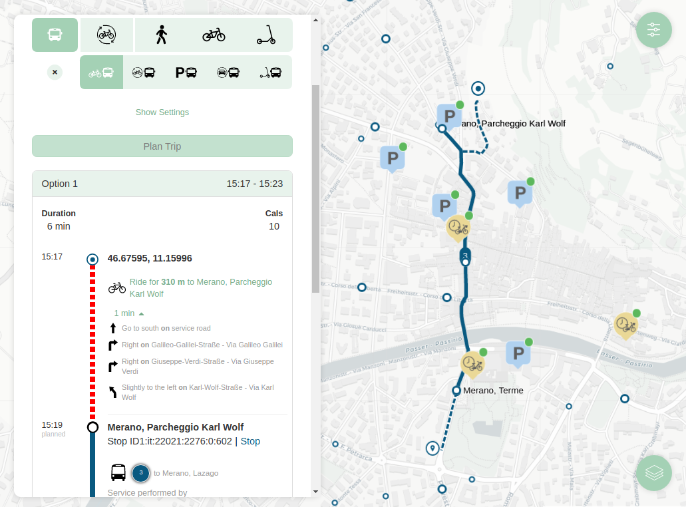

# Mentor

This project contains a Docker images for stable [OpenTripPlanner](http://opentripplanner.org) releases and tools to auto download Openstreetmap data related to a certain gtfs file.

## Table of contents

- [Gettings started](#getting-started)
  - [Prerequisites](#prerequisites)
  - [Source code](#source-code)
  - [Docker environment](#docker)
- [Information](#information)



## Getting started

### Prerequisites

To build the project, the following prerequisites must be met:

- Docker
- Docker-compose

If you want to run the application using [Docker](https://www.docker.com/), the environment is already set up with all dependencies for you. You only have to install [Docker](https://www.docker.com/) and [Docker Compose](https://docs.docker.com/compose/)

### Source code

Get a copy of the repository:

```bash
git clone https://github.com/noi-techpark/odh-mentor-otp.git
```

Change directory:

```bash
cd odh-mentor-otp
```

#### Scripts and sub folders

```docker-entrypoint.sh``` download and build data graph

```otp.sh``` a script to run otp by command line

```otp-unofficial.sh``` a script to run otp unofficial version by command line

```router-config.json``` define OTP updaters(GTFS-RT) and router settings from environment vars

```build-config.json``` default OTP build config from environment vars

```osm.url``` a pregenerated urls list of downloadable Openstreetmap data for SouthTyrol area.

```journey/``` static javascript client side react/redux UI component to interact with Opentriplanner instance.

```gbfs/``` service that fetch bikesharing data from ODH and provide them as GBFS for otp.

```gtfs2bbox/``` nodejs tool to calculate bounding boxes of Openstreetmap intersects GTFS data for downloading, create a list of overpass downloadable urls

```geocoder/``` nodejs simplified implementation of Pelias Geocoder

### Docker Environment

In each service directory the file `.env.example` list the default env vars by service.
Below is a list of env variables for each container:

##### otp

```JAVA_MX``` the amount of heap space available to OpenTripPlanner. (The `otp.sh` script adds `-Xmx$JAVA_MX` to the `java` command.) Default: 2G

```OTP_OFFICIAL``` if *True* will use the OpenTripPlanner Official Version, otherwise the IBI-Group Version [(see Compatibility)](#compatibility)

##### build

in addition to those of *otp* vars

```BUILD_GRAPH``` if *True* force the re/construction of the roads graph starting from the data: osm, gtfs, srtm. Generate a new *Graph.obj* file in the path ```/opt/odh-mentor-otp/openmove/Graph.obj```

```DOWNLOAD_DATA``` if *True* download openstreetmap and terrain model data around the gtfs file

```BACKUP_GRAPH``` if *True* create also a backup copy for each new graph in path */opt/odh-mentor-otp/Graph.obj.%y-%m-%d.tgz*

```UPDATERS``` if *True* create the router-config.json with GBFS/GTFS-RT updaters

```GBFS_HOST``` host path to GBFS service

```GBFS_VERSION``` gbfs version 1 or 2.1 (rebuild graph is required)

```GTFS_URL``` gtfs source ftp uri of gtfs .zip file to download

```GTFS_URL_UPDATETIME``` gtfs source time interval in cronjob style (i.e. `*/30 * * * *` for every 30 minutes)

```GTFS_URL_UPDATEHOOK``` url hook to restart build service

```GTFS_FILE``` the name of gtfs zip file to auto download Openstreetmap data

```GTFS_RT_URL``` gtfs-realtime url with trip updates (rebuild graph is required)

```GTFS_FEED_ID``` gtfs feed id which the gtfs-rt refers to. This is the defined by the  'feed_id' value (unofficial) inside feed_info.txt, if not defined this should be "1" (rebuild graph is required)

```OTP_OFFICIAL``` if *True* will use the OpenTripPlanner Official Version, otherwise the IBI-Group Version [(see Compatibility)](#compatibility)

```CARSHARING_HOST``` host path to Carsharing service

```PARKING_HOST``` host path to parking service

```CHARGER_HOST``` host path to charger service


#### geocoder

```API_HOST``` deployed hostname of OpenTripPlanner api default: ```localhost``` (name of deployed)

```API_PATH``` aboslute url path ```/otp/routers/openmove```

```API_PORT``` port default ```8080``` (port of internal service otp)

```HERE_APPID``` here geocoder api appId params

```HERE_APPCODE``` here geocoder api appCode params

### Building Arguments

Below is a list of Docker args variables for each container:

#### otp, builder

```OTP_VERSION``` version of OpenTripPlanner binary downloaded from official repos, default is 1.4.0

#### journey

```API_HOST``` deployed hostname of OpenTripPlanner api default: ```localhost``` (name of deployed)

```API_PATH``` aboslute url path ```/otp/routers/openmove```

```API_PORT``` port default ```8080``` (port of internal service otp)

```GEOCODER_BASEURL``` default pelias geoder instance http://localhost/geocoder/v1

```PARKING_BASEURL``` host path to Parking to show in map

```CHARGER_BASEURL``` host path to Charger stationsto show in map

```GOOGLE_ANALYTICS_ID``` google analytics tracking code UA-XXXXX-Y

Then you can start the application using the following command:

#### First build Graph and Cache

```bash
docker-compose up build
```

#### Compatibility

In OpenTripPlanner is not allowed running a graph built with a different version.
In case you change the OpenTripPlanner version or switch from/to Ufficial/IBI-Group Version **you have to rebuild the graph**.  

#### Execute OTP instance

```bash
docker-compose up otp
```
After the graph has been built, the planner is available at port *8080*.


#### Services

defined in docker-compose.yml, both of these services are defined by the same docker image which behaves differently according to the defined environment parameters.

```build``` build a new OTP graph by gtfs file in /opt/odh-mentor-otp/ directory, automatically stopped on finish, ```docker logs``` notice if the building was successful.

```otp``` run a new instance of OTP by /opt/odh-mentor-otp/, distribute API rest and default UI on port 8080, need restart: "always"

#### Volumes

```/opt/odh-mentor-otp/:/data/``` the path used in reading and writing in which the Osm, Altimetric data are downloaded. It must contains the GTFS zip file before building the graph. Here where the graph generated will be written by OTP, in path:
```/opt/odh-mentor-otp/openmove/Graph.obj```

## Information

### Guidelines

Find [here](https://opendatahub.readthedocs.io/en/latest/guidelines.html) guidelines for developers.

### Support

ToDo: For support, please contact [info@opendatahub.bz.it](mailto:info@opendatahub.bz.it).

### Contributing

If you'd like to contribute, please follow the following instructions:

- Fork the repository.

- Checkout a topic branch from the `development` branch.

- Make sure the tests are passing.

- Create a pull request against the `development` branch.

A more detailed description can be found here: [https://github.com/noi-techpark/documentation/blob/master/contributors.md](https://github.com/noi-techpark/documentation/blob/master/contributors.md).

### Documentation

More documentation can be found at [https://opendatahub.readthedocs.io/en/latest/index.html](https://opendatahub.readthedocs.io/en/latest/index.html).

### Boilerplate

The project uses this boilerplate: [https://github.com/noi-techpark/java-boilerplate](https://github.com/noi-techpark/java-boilerplate).
